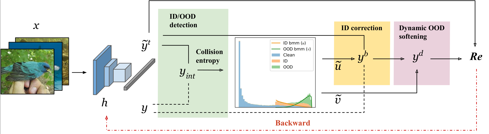

# Official Pytorch implementation for *Addressing out-of-distribution label noise in webly-labelled data*.
Paper link: [thecvf](https://openaccess.thecvf.com/content/WACV2022/html/Albert_Addressing_Out-of-Distribution_Label_Noise_in_Webly-Labelled_Data_WACV_2022_paper.html)



## Set dataset location
The path to the datasets should be set in the **mypath.py** file

## Experiments
```
bash train.sh
```
You can resume a checkpoint using 
```
--resume path/to/checkpoint.pth.tar
```

## Trained model
The models trained on Webvision can be downloaded here (--seeds 1, 2 ,3): [gdrive](https://drive.google.com/drive/folders/1A0Z2CmKWhz9PlNaq4Rov1QMaiM48wmiz?usp=sharing)

##Testing on imagenet
The model trained on Webvision can be tested on the Imagenet validation set using

```
python eval_imagenet.py model1_state_dict.pth.tar
```

and optionally for an ensemble

```
python eval_imagenet.py model1_state_dict.pth.tar model2_state_dict.pth.tar
```

## Cite the  paper
```
@inproceedings{2022_WACV_DSOS,
  title="{Addressing out-of-distribution label noise in webly-labelled data}",
  author="Albert, Paul and Ortego, Diego and Arazo, Eric and O{'}Connor, Noel and McGuinness, Kevin",
  booktitle="{Winter Conference on Applications of Computer Vision (WACV)}",
  year="2022"}
```